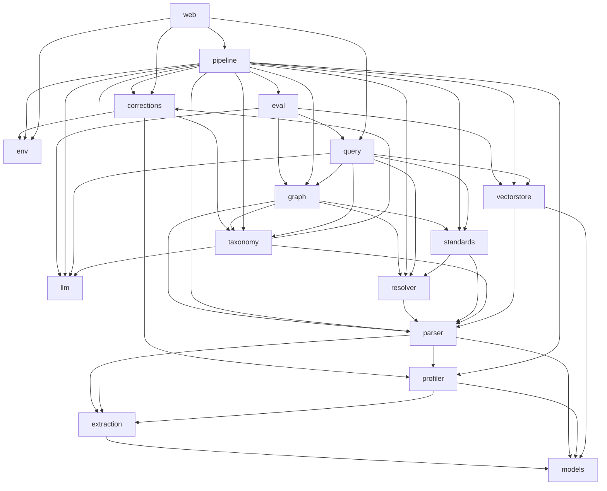

# MAP

Generated 2026-04-27 by regen-map. Do not hand-edit.

## Modules

| Module | Purpose |
| --- | --- |
| [corrections](../../core/src/corrections/MODULE.md) | Per-environment profile + taxonomy correction handling: store engineer-edited overrides, diff them against pipeline output, and emit compact FIX reports (no proprietary content) that are pasteable back into chat. |
| [env](../../core/src/env/MODULE.md) | Per-environment scoped workspace configuration. |
| [eval](../../core/src/eval/MODULE.md) | Evaluation framework for the query pipeline. |
| [extraction](../../core/src/extraction/MODULE.md) | Format-aware content extraction. |
| [graph](../../core/src/graph/MODULE.md) | Unified Knowledge Graph construction (TDD §5.8, D-002). |
| [llm](../../core/src/llm/MODULE.md) | LLM abstraction layer. |
| [models](../../core/src/models/MODULE.md) | Shared document intermediate representation. |
| [parser](../../core/src/parser/MODULE.md) | Generic, profile-driven structural parser. |
| [pipeline](../../core/src/pipeline/MODULE.md) | Staged, re-runnable pipeline that drives the nine-stage offline flow: `extract → profile → parse → resolve → taxonomy → standards → graph → vectorstore → eval`. |
| [profiler](../../core/src/profiler/MODULE.md) | Standalone, LLM-free document-structure profiler. |
| [query](../../core/src/query/MODULE.md) | Online query pipeline (TDD §7). |
| [resolver](../../core/src/resolver/MODULE.md) | Deterministic cross-reference resolver (TDD §5.5, Methods 1 & 2). |
| [standards](../../core/src/standards/MODULE.md) | 3GPP standards ingestion — generic, release-aware, LLM-free (TDD §5.6, D-004). |
| [taxonomy](../../core/src/taxonomy/MODULE.md) | Bottom-up, LLM-derived feature taxonomy for the corpus (TDD §5.7). |
| [vectorstore](../../core/src/vectorstore/MODULE.md) | Unified vector-store construction and configuration. |
| [web](../../core/src/web/MODULE.md) | FastAPI + Bootstrap 5 + HTMX Web UI for non-CLI team members (D-008). |

## Dependency graph



## Project File Structure

_Alphabetical, regenerated by regen-map. Directory descriptions come from MODULE.md Purpose; file descriptions come from the per-language description-source rule in `structure-conventions.md`._

```
nora/
├── CLAUDE.md
├── CONTRIBUTING.md
├── KnowledgeGraph_Role_And_Examples.md
├── NORA_BigPicture.html
├── NORA_Overview.pptx
├── README.md
├── SESSION_SUMMARY.md
├── SETUP_OFFLINE.md
├── TDD_Telecom_Requirements_AI_System.md
├── assets/
│   └── hf_cache/
│       └── all-MiniLM-L6-v2.tgz
├── config/
│   └── web.json
├── core/
│   ├── __init__.py
│   ├── src/
│   │   ├── __init__.py
│   │   ├── corrections/                                  # Per-environment profile + taxonomy correction handling: store engineer-edited overrides, diff them against pipeline output, and emit compact FIX reports (no proprietary content) that are pasteable back into chat.
│   │   │   ├── MODULE.md
│   │   │   ├── __init__.py                               # Corrections module — profile + taxonomy editing, diff, and compact FIX reports.
│   │   │   ├── compactor.py                              # Compact FIX report generators for profile and taxonomy corrections.
│   │   │   ├── schema.py                                 # Data models for correction FIX reports.
│   │   │   └── store.py                                  # CorrectionStore — per-environment correction file management.
│   │   ├── env/                                          # Per-environment scoped workspace configuration.
│   │   │   ├── MODULE.md
│   │   │   ├── __init__.py
│   │   │   ├── config.py                                 # Environment configuration for multi-user pipeline workflows.
│   │   │   └── env_cli.py                                # CLI for environment management.
│   │   ├── eval/                                         # Evaluation framework for the query pipeline.
│   │   │   ├── MODULE.md
│   │   │   ├── __init__.py
│   │   │   ├── eval_cli.py                               # CLI for the evaluation framework (PoC Step 11).
│   │   │   ├── metrics.py                                # Evaluation metrics for the query pipeline (TDD 9.4).
│   │   │   ├── questions.py                              # Evaluation test question set with ground truth (TDD 9.4).
│   │   │   └── runner.py                                 # Evaluation runner (TDD 9.4, Step 11).
│   │   ├── extraction/                                   # Format-aware content extraction.
│   │   │   ├── MODULE.md
│   │   │   ├── __init__.py
│   │   │   ├── base.py                                   # Base extractor interface for all format-specific extractors.
│   │   │   ├── docx_extractor.py                         # DOCX content extractor using python-docx.
│   │   │   ├── extract.py                                # CLI entry point for document content extraction.
│   │   │   ├── pdf_extractor.py                          # PDF content extractor using pymupdf (text + images) and pdfplumber (tables).
│   │   │   └── registry.py                               # Extractor registry — maps file extensions to format-specific extractors.
│   │   ├── graph/                                        # Unified Knowledge Graph construction (TDD §5.8, D-002).
│   │   │   ├── MODULE.md
│   │   │   ├── __init__.py
│   │   │   ├── builder.py                                # Knowledge Graph builder (TDD 5.8).
│   │   │   ├── graph_cli.py                              # CLI entry point for Knowledge Graph construction (TDD 5.8).
│   │   │   └── schema.py                                 # Knowledge Graph schema definitions (TDD 6.1–6.2).
│   │   ├── llm/                                          # LLM abstraction layer.
│   │   │   ├── MODULE.md
│   │   │   ├── __init__.py
│   │   │   ├── base.py                                   # LLM provider abstraction layer.
│   │   │   ├── mock_provider.py                          # Mock LLM provider for testing without API keys.
│   │   │   ├── model_picker.py                           # Hardware detection and LLM model selection.
│   │   │   └── ollama_provider.py                        # Ollama LLM provider for local model inference.
│   │   ├── models/                                       # Shared document intermediate representation.
│   │   │   ├── MODULE.md
│   │   │   ├── __init__.py
│   │   │   └── document.py                               # Normalized intermediate representation for extracted documents.
│   │   ├── parser/                                       # Generic, profile-driven structural parser.
│   │   │   ├── MODULE.md
│   │   │   ├── __init__.py
│   │   │   ├── parse_cli.py                              # CLI entry point for the generic structural parser.
│   │   │   └── structural_parser.py                      # Generic, profile-driven structural parser (TDD 5.3).
│   │   ├── pipeline/                                     # Staged, re-runnable pipeline that drives the nine-stage offline flow: `extract → profile → parse → resolve → taxonomy → standards → graph → vectorstore → eval`.
│   │   │   ├── MODULE.md
│   │   │   ├── __init__.py
│   │   │   ├── error_codes.py                            # Structured error codes for all pipeline stages.
│   │   │   ├── report.py                                 # Pipeline report generation.
│   │   │   ├── run_cli.py                                # CLI entry point for the pipeline runner.
│   │   │   ├── runner.py                                 # Pipeline orchestrator.
│   │   │   └── stages.py                                 # Pipeline stage functions.
│   │   ├── profiler/                                     # Standalone, LLM-free document-structure profiler.
│   │   │   ├── MODULE.md
│   │   │   ├── __init__.py
│   │   │   ├── profile_cli.py                            # CLI entry point for the DocumentProfiler.
│   │   │   ├── profile_schema.py                         # Document structure profile schema (TDD 5.2.3).
│   │   │   └── profiler.py                               # DocumentProfiler — standalone, LLM-free document structure analysis.
│   │   ├── query/                                        # Online query pipeline (TDD §7).
│   │   │   ├── MODULE.md
│   │   │   ├── __init__.py
│   │   │   ├── analyzer.py                               # Query analyzer (TDD 7.1).
│   │   │   ├── context_builder.py                        # Context assembler (TDD 7.5).
│   │   │   ├── graph_scope.py                            # Graph scoper (TDD 7.3).
│   │   │   ├── pipeline.py                               # Query pipeline orchestrator (TDD 7).
│   │   │   ├── query_cli.py                              # CLI for the query pipeline (PoC Step 10).
│   │   │   ├── rag_retriever.py                          # Targeted vector RAG retriever (TDD 7.4).
│   │   │   ├── resolver.py                               # MNO and release resolver (TDD 7.2).
│   │   │   ├── schema.py                                 # Query pipeline data models (TDD 7.1-7.6).
│   │   │   └── synthesizer.py                            # LLM synthesizer (TDD 7.6).
│   │   ├── resolver/                                     # Deterministic cross-reference resolver (TDD §5.5, Methods 1 & 2).
│   │   │   ├── MODULE.md
│   │   │   ├── __init__.py
│   │   │   ├── resolve_cli.py                            # CLI entry point for cross-reference resolution.
│   │   │   └── resolver.py                               # Cross-reference resolver (TDD 5.5, Methods 1 & 2).
│   │   ├── standards/                                    # 3GPP standards ingestion — generic, release-aware, LLM-free (TDD §5.6, D-004).
│   │   │   ├── MODULE.md
│   │   │   ├── __init__.py
│   │   │   ├── reference_collector.py                    # Standards reference collector (TDD 5.6, Step 1).
│   │   │   ├── schema.py                                 # Data models for standards ingestion (TDD 5.6).
│   │   │   ├── section_extractor.py                      # Selective section extraction from parsed 3GPP specs (TDD 5.6, Step 2).
│   │   │   ├── spec_downloader.py                        # 3GPP spec downloader with local caching.
│   │   │   ├── spec_parser.py                            # 3GPP specification document parser (DOC/DOCX to section tree).
│   │   │   ├── spec_resolver.py                          # 3GPP spec version resolver and URL builder.
│   │   │   └── standards_cli.py                          # CLI entry point for standards ingestion pipeline.
│   │   ├── taxonomy/                                     # Bottom-up, LLM-derived feature taxonomy for the corpus (TDD §5.7).
│   │   │   ├── MODULE.md
│   │   │   ├── __init__.py
│   │   │   ├── consolidator.py                           # Feature taxonomy consolidation (TDD 5.7, Step 2 — single MNO).
│   │   │   ├── extractor.py                              # Document-level feature extraction (TDD 5.7, Step 1).
│   │   │   ├── schema.py                                 # Feature taxonomy data model (TDD 5.7).
│   │   │   └── taxonomy_cli.py                           # CLI entry point for feature taxonomy extraction and consolidation.
│   │   ├── vectorstore/                                  # Unified vector-store construction and configuration.
│   │   │   ├── MODULE.md
│   │   │   ├── __init__.py
│   │   │   ├── builder.py                                # Vector store builder (TDD 5.9).
│   │   │   ├── chunk_builder.py                          # Chunk builder for contextualized requirement chunks (TDD 5.9).
│   │   │   ├── config.py                                 # Vector store configuration.
│   │   │   ├── embedding_base.py                         # Embedding provider abstraction layer.
│   │   │   ├── embedding_st.py                           # Sentence-transformers embedding provider.
│   │   │   ├── hf_offline.py                             # Enable HuggingFace Hub offline mode when the model is already cached.
│   │   │   ├── store_base.py                             # Vector store abstraction layer.
│   │   │   ├── store_chroma.py                           # ChromaDB vector store backend.
│   │   │   └── vectorstore_cli.py                        # CLI for vector store construction (PoC Step 9).
│   │   └── web/                                          # FastAPI + Bootstrap 5 + HTMX Web UI for non-CLI team members (D-008).
│   │       ├── MODULE.md
│   │       ├── __init__.py
│   │       ├── app.py                                    # NORA Web UI — FastAPI application.
│   │       ├── config.py                                 # Web UI configuration.
│   │       ├── jobs.py                                   # Job queue for NORA pipeline execution tracking.
│   │       ├── metrics.py                                # Metrics persistence store for NORA observability.
│   │       ├── middleware.py                             # Request timing middleware for NORA Web UI.
│   │       ├── path_mapper.py                            # Path translation between Windows UNC paths and Linux mount points.
│   │       ├── resource_sampler.py                       # Background resource sampler for NORA observability.
│   │       ├── routes/
│   │       │   ├── __init__.py                           # Web UI route packages.
│   │       │   ├── corrections.py                        # Corrections routes — profile + taxonomy editors and compact FIX reports.
│   │       │   ├── dashboard.py                          # Dashboard page and API routes.
│   │       │   ├── environments.py                       # Environments page and API routes.
│   │       │   ├── files.py                              # File browser page and routes.
│   │       │   ├── jobs.py                               # Jobs routes -- listing, detail, SSE log streaming, cancel.
│   │       │   ├── metrics_route.py                      # Metrics page and API routes.
│   │       │   ├── pipeline.py                           # Pipeline page and API routes.
│   │       │   └── query.py                              # Query page and API routes.
│   │       ├── static/
│   │       │   ├── css/
│   │       │   │   └── style.css
│   │       │   ├── js/
│   │       │   │   └── app.js
│   │       │   └── vendor/
│   │       │       ├── bootstrap/
│   │       │       │   ├── bootstrap.bundle.min.js
│   │       │       │   └── bootstrap.min.css
│   │       │       ├── bootstrap-icons/
│   │       │       │   ├── bootstrap-icons.min.css
│   │       │       │   └── fonts/
│   │       │       │       ├── bootstrap-icons.woff
│   │       │       │       └── bootstrap-icons.woff2
│   │       │       └── htmx/
│   │       │           └── htmx.min.js
│   │       └── templates/
│   │           ├── base.html
│   │           ├── corrections/
│   │           │   ├── index.html
│   │           │   ├── profile.html
│   │           │   ├── report.html
│   │           │   └── taxonomy.html
│   │           ├── dashboard.html
│   │           ├── environment_new.html
│   │           ├── environments.html
│   │           ├── files.html
│   │           ├── job_detail.html
│   │           ├── jobs.html
│   │           ├── metrics.html
│   │           ├── partials/
│   │           │   ├── dashboard_jobs.html
│   │           │   ├── dashboard_status.html
│   │           │   ├── file_listing.html
│   │           │   ├── jobs_table.html
│   │           │   ├── metrics_resource.html
│   │           │   └── query_result.html
│   │           ├── pipeline.html
│   │           └── query.html
│   └── tests/
│       ├── __init__.py
│       ├── test_document_ir.py                           # Tests for DocumentIR serialize/deserialize round-trip.
│       ├── test_eval.py                                  # Tests for the evaluation framework (Step 11).
│       ├── test_graph.py                                 # Tests for the Knowledge Graph construction (Step 8).
│       ├── test_patterns.py                              # Tests for regex patterns used across extraction, profiling, and parsing.
│       ├── test_pipeline.py                              # Pipeline smoke tests — extract, profile, and parse real PDFs.
│       ├── test_profile_schema.py                        # Tests for DocumentProfile serialize/deserialize round-trip.
│       ├── test_query.py                                 # Tests for the query pipeline (PoC Step 10).
│       ├── test_resolver.py                              # Tests for the cross-reference resolver.
│       ├── test_standards.py                             # Tests for the standards ingestion pipeline (Step 7).
│       ├── test_taxonomy.py                              # Tests for the feature taxonomy pipeline (Step 6).
│       ├── test_vectorstore.py                           # Tests for vector store construction (PoC Step 9).
│       ├── test_web_jobs.py                              # Tests for the NORA web job queue.
│       └── test_web_path_mapper.py                       # Tests for the web path mapper module.
├── create_presentation.py                                # Generate NORA leadership presentation.
├── customizations/
│   ├── __init__.py
│   ├── llm/
│   │   ├── README.md
│   │   ├── __init__.py
│   │   ├── proprietary_provider.py                       # Proprietary LLM provider stub.
│   │   └── tests/
│   │       ├── __init__.py
│   │       └── test_proprietary_provider.py              # Smoke tests for the ProprietaryLLMProvider stub.
│   └── profiles/
│       ├── tests/
│       └── vzw_oa_profile.json
├── docs/
│   └── compact/
│       ├── DECISIONS.md
│       ├── MAP.md
│       ├── PROJECT.md
│       ├── STATUS.md
│       ├── design-inputs/
│       │   ├── README.md
│       │   ├── SESSION_SUMMARY.md
│       │   ├── SETUP_OFFLINE.md
│       │   └── TDD_Telecom_Requirements_AI_System.md
│       ├── phases/
│       │   ├── architecture.md
│       │   ├── development.md
│       │   └── requirements.md
│       ├── project-init-interview.md
│       ├── requirements.md
│       ├── retrofit-snapshot.md
│       └── structure-conventions.md
├── download_urls.txt
├── requirements.txt
├── setup_env.sh                                          # Setup script for NORA (Network Operator Requirements Analyzer).
├── update_presentation.py                                # Add Human Filter philosophy to NORA presentation.
└── visualizations/
    ├── build_viz_data.py                                 # Build a self-contained JS data bundle for the NORA visualizations.
    ├── cose-base.js
    ├── cytoscape-cose-bilkent.js
    ├── cytoscape.min.js
    ├── knowledge_graph.html
    ├── layout-base.js
    ├── nora_data.js
    ├── query_simulation.html
    └── taxonomy.html
```
