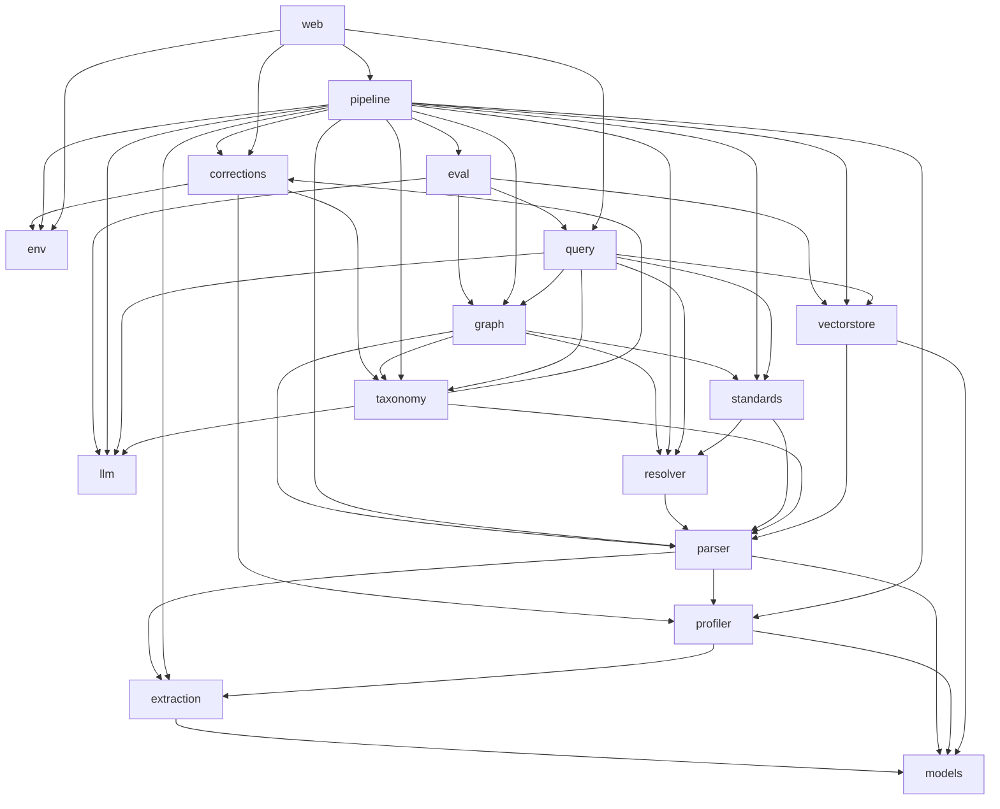

# MAP

Generated 2026-04-21 by regen-map. Do not hand-edit.

## Modules

| Module | Purpose |
| --- | --- |
| [corrections](../../src/corrections/MODULE.md) | Per-environment profile + taxonomy correction handling: store engineer-edited overrides, diff them against pipeline output, and emit compact FIX reports (no proprietary content) that are pasteable back into chat. |
| [env](../../src/env/MODULE.md) | Per-environment scoped workspace configuration. |
| [eval](../../src/eval/MODULE.md) | Evaluation framework for the query pipeline. |
| [extraction](../../src/extraction/MODULE.md) | Format-aware content extraction. |
| [graph](../../src/graph/MODULE.md) | Unified Knowledge Graph construction (TDD §5.8, D-002). |
| [llm](../../src/llm/MODULE.md) | LLM abstraction layer. |
| [models](../../src/models/MODULE.md) | Shared document intermediate representation. |
| [parser](../../src/parser/MODULE.md) | Generic, profile-driven structural parser. |
| [pipeline](../../src/pipeline/MODULE.md) | Staged, re-runnable pipeline that drives the nine-stage offline flow: `extract → profile → parse → resolve → taxonomy → standards → graph → vectorstore → eval`. |
| [profiler](../../src/profiler/MODULE.md) | Standalone, LLM-free document-structure profiler. |
| [query](../../src/query/MODULE.md) | Online query pipeline (TDD §7). |
| [resolver](../../src/resolver/MODULE.md) | Deterministic cross-reference resolver (TDD §5.5, Methods 1 & 2). |
| [standards](../../src/standards/MODULE.md) | 3GPP standards ingestion — generic, release-aware, LLM-free (TDD §5.6, D-004). |
| [taxonomy](../../src/taxonomy/MODULE.md) | Bottom-up, LLM-derived feature taxonomy for the corpus (TDD §5.7). |
| [vectorstore](../../src/vectorstore/MODULE.md) | Unified vector-store construction and configuration. |
| [web](../../src/web/MODULE.md) | FastAPI + Bootstrap 5 + HTMX Web UI for non-CLI team members (D-008). |

## Dependency graph

